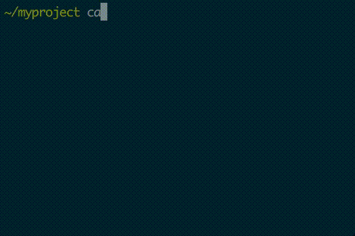

# jadd 

Tool for adding dependencies to gradle/maven/sbt build files

## REPL!

Just run `jadd` without arguments and enjoy! 

## usage

    jadd i org.apache.httpcomponents:httpclient
    jadd i logback-classic gson commons-io io.grpc:grpc-protobuf
    jadd i mongodb h2 postgresql mysql rest-assured

## commands

- `install` (shortcut `i`) add dependency to build file

- `search` (shortcut `s`) print dependency to console

- `analyze` search dependency in multiple repositories and print all available versions

- `show` show build file source

- `help`

## installation

    curl -s https://raw.githubusercontent.com/d10xa/jadd/master/install.sh | bash

And then add following to `~/.profile or ~/.bashrc or ~/.zshrc`

    export PATH=$PATH:$HOME/.jadd/bin

## update

    just run installation script

## examples

### maven

    mvn archetype:generate -DgroupId=com.example -DartifactId=example-mvn -DarchetypeArtifactId=maven-archetype-quickstart -DinteractiveMode=false
    cd example-mvn
    jadd i logback-classic

### gradle

    mkdir example-gradle
    cd example-gradle
    gradle init --type java-application
    jadd i mysql

### sbt

    sbt new scala/scala-seed.g8
    # name [Scala Seed Project]: example-sbt
    cd example-sbt
    jadd i akka-http

## analyze dependency

    # only full artifactId supported. shortcuts not available
    jadd analyze --repository=bintray/groovy/maven,google,jcenter,mavenCentral org.codehaus.groovy:groovy-eclipse-compiler
